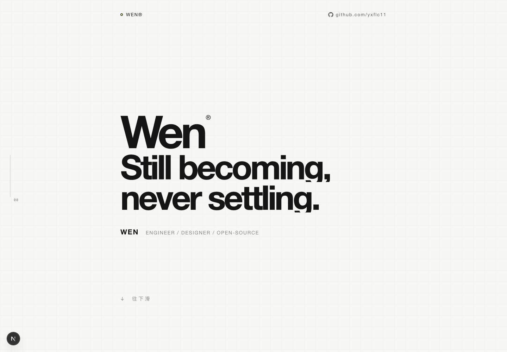
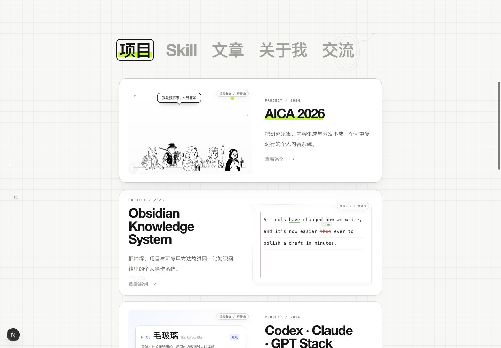
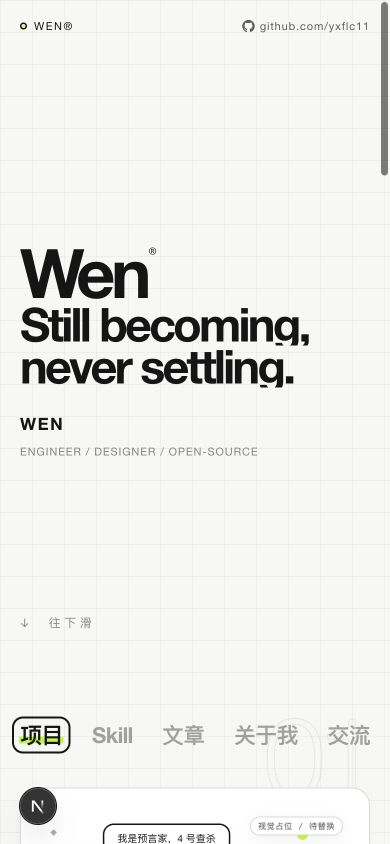

# WENWEB

WENWEB is a static-first portfolio and publishing system for presenting projects, technical writing, reusable AI workflows, and collaboration channels in one interface.

WENWEB 是一个静态优先的作品与内容发布系统，用统一界面展示项目、技术文章、可复用 AI 工作流与协作入口。



*Figure 1 / 图 1 — The desktop shell uses an editorial grid, oversized typography, and a restrained fluorescent accent. The layout is rendered from the running application, without a separate presentation mockup. 桌面首屏采用编辑式网格、超大字号与克制的荧光强调色；画面直接来自实际运行页面，而非独立演示稿。*

## Technical profile / 技术概览

| Layer / 层级 | Implementation / 实现 |
| --- | --- |
| Application / 应用 | Next.js 16 App Router, React 19, TypeScript 6 |
| Content / 内容 | Keystatic local authoring, Markdoc source files, static route generation |
| Interaction / 交互 | Accessible tabs, keyboard navigation, reduced-motion support, responsive CSS |
| Visual runtime / 视觉运行时 | CSS editorial grid for the primary surface; Three.js and React Three Fiber for selected legacy visual modules |
| Delivery / 交付 | Static export, unprivileged NGINX container, immutable image tags, CI smoke tests |

The production homepage is deliberately lightweight: semantic React components, CSS-driven layout, locally served assets, and no client-side content API. Interactive categories share one content surface while preserving native links for published routes.

正式首页保持轻量：使用语义化 React 组件、CSS 布局与本地资源，不依赖客户端内容 API。多个内容分类共用同一展示区域，已发布内容仍保留原生链接行为。



*Figure 2 / 图 2 — Category state is exposed through ARIA tabs. Published cards remain navigable links, while draft cards are non-interactive and labeled as pending content. 分类状态通过 ARIA 标签页表达；已发布卡片保持可导航链接，草稿卡片不可交互并明确标记为待完善内容。*

## Interface architecture / 界面架构

The interface is organized into four independent runtime concerns:

界面运行时拆分为四个互不耦合的关注点：

- **Shell / 外壳** — metadata, route-aware chrome, focus handling, and global accessibility behavior.
- **Content model / 内容模型** — route-private configuration for projects, skills, articles, profile blocks, and external channels.
- **Presentation / 呈现** — reusable cards, tab panels, grid decoration, and responsive typography.
- **Motion / 动效** — progressive enhancement with reduced-motion fallbacks; content remains usable when animation is unavailable.

The root route renders the primary WEN surface without the older global canvas or navigation chrome. Long-form writing and case-study routes continue to use the existing reading shell, so the landing experience can evolve without destabilizing the publishing system.

根路由直接渲染主要 WEN 界面，不挂载旧版全局画布与导航外壳。长文与案例详情继续使用既有阅读外壳，因此首页可以独立演进，而不会影响内容发布系统。

## Responsive system / 响应式系统

The mobile layout is not a scaled desktop canvas. Type sizes, card composition, tab spacing, metadata density, and viewport gutters are recalculated for narrow screens. The verified 390 px layout keeps the five primary tabs available, avoids horizontal overflow, and preserves readable card hierarchy.

手机端不是桌面画面的等比缩小。字号、卡片结构、标签间距、元信息密度与视口留白都会针对窄屏重新计算。经过验证的 390 px 布局完整保留五个主要标签，无横向溢出，并维持清晰的卡片层级。



*Figure 3 / 图 3 — The 390 px capture verifies the production breakpoint: the headline reflows intentionally, navigation remains complete, and the content surface begins within the same viewport. 390 px 实际截图验证了生产断点：标题按设计换行、导航保持完整，首屏内即可看到内容区域起点。*

## Content architecture / 内容架构

Writing and work are separate file-backed collections:

文章与项目采用两个独立的文件型内容集合：

- `src/content/posts/*.mdoc` stores writing.
- `src/content/work/*.mdoc` stores case studies.
- `src/data.ts` provides shared navigation and contact data.
- Route-private configuration provides the homepage content model and publication state.

Keystatic is available only for local authoring. The public artifact excludes both the editing interface and its API routes. Content changes are reviewed as source changes, then compiled into static pages during CI.

Keystatic 仅用于本地编辑。公开构建产物会移除编辑界面及对应 API 路由。内容修改以源码形式接受审查，并在 CI 中编译为静态页面。

## Production boundary / 生产边界

`npm run build:static` creates an isolated build workspace, copies only required application inputs, removes local-only authoring routes, enables the static export boundary, and publishes the generated `out/` directory.

`npm run build:static` 会创建隔离构建目录，仅复制必要的应用输入，移除仅限本地使用的编辑路由，启用静态导出边界，并生成最终 `out/` 目录。

The container uses a two-stage build:

容器采用两阶段构建：

1. Node.js 24 builds and verifies the static export.
2. Unprivileged NGINX serves the artifact on port `8080` and checks `/healthz`.

Both base images are digest-pinned. The runtime contains static files only, which reduces the public attack surface and removes production CMS credentials entirely.

两个基础镜像均固定到摘要版本。运行容器只包含静态文件，从而缩小公开攻击面，并彻底避免在生产环境中携带 CMS 凭证。

## CI and release integrity / CI 与发布完整性

Pull requests run dependency installation, high-severity audit enforcement, static generation, route-boundary checks, and a non-root container smoke test. Main-branch releases publish an immutable commit-addressed image to GHCR with SBOM and provenance metadata. Optional deployment selects the exact image tag and validates both the public health endpoint and the running registry digest.

Pull Request 会执行依赖安装、高危漏洞审计、静态生成、路由边界检查与非 root 容器冒烟测试。主分支发布使用提交哈希生成不可变 GHCR 镜像，并附带 SBOM 与来源证明。可选部署流程会选择精确镜像标签，同时验证公开健康检查与实际运行镜像摘要。

## Local development / 本地开发

```bash
npm install
npm run dev
npm run build
npm run build:static
```

The development server listens on `http://127.0.0.1:4173`. Local authoring is available at `/keystatic`; that route does not exist in the exported production site.

开发服务器默认运行在 `http://127.0.0.1:4173`。本地内容编辑入口为 `/keystatic`；该路由不会出现在生产静态导出中。

## Public routes / 公开路由

| Route / 路由 | Purpose / 用途 |
| --- | --- |
| `/` | Primary project and profile surface / 主要项目与内容界面 |
| `/blog` | Writing index / 文章索引 |
| `/blog/[slug]` | Static article / 静态文章详情 |
| `/work/[slug]` | Static case study / 静态案例详情 |
| `/contact` | Collaboration entry / 协作入口 |
| `/healthz` | Deployment health check / 部署健康检查 |

## Accessibility and resilience / 可访问性与韧性

- Semantic landmarks and heading structure support assistive navigation.
- Tabs expose selected state and support click, Left/Right, Home, and End navigation.
- Focus indicators remain visible across mouse and keyboard use.
- Reduced-motion preferences disable non-essential transitions.
- Touch and narrow-screen layouts do not depend on WebGL.
- Local fonts and local media keep builds independent of third-party asset delivery.

- 语义化地标与标题结构支持辅助导航。
- 标签页公开当前选择状态，并支持点击、左右方向键、Home 与 End 键。
- 鼠标和键盘操作都保留清晰的焦点指示。
- 系统开启减少动态效果后，会停用非必要过渡。
- 触控与窄屏布局不依赖 WebGL。
- 本地字体与媒体资源避免构建过程依赖第三方资源服务。

## Repository map / 仓库结构

| Path / 路径 | Responsibility / 职责 |
| --- | --- |
| `src/app` | App Router pages, metadata, and route boundaries / 页面、元数据与路由边界 |
| `src/components` | Interface, content, reading, and visual components / 界面、内容、阅读与视觉组件 |
| `src/content` | Markdoc writing and case studies / Markdoc 文章与案例 |
| `public` | Fonts, screenshots, and runtime media / 字体、截图与运行媒体 |
| `scripts` | Isolated static export tooling / 隔离静态导出工具 |
| `.github/workflows` | Verification, container publishing, and deployment gates / 验证、容器发布与部署门禁 |
